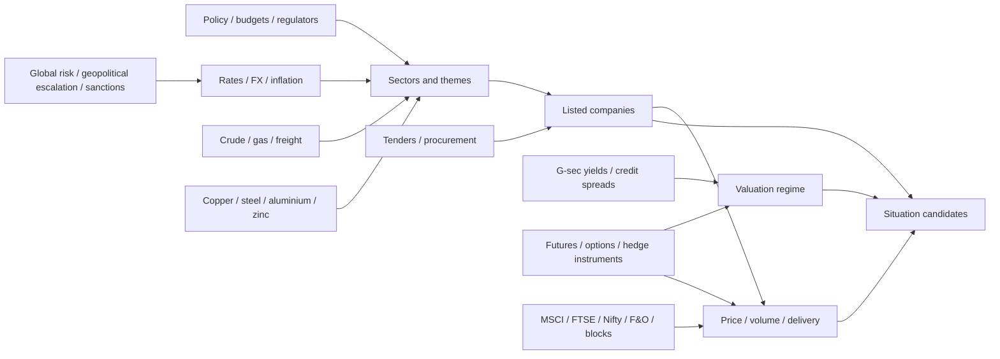

# HIVEMIND Market Intelligence Architecture

Status: canonical architecture theory  
Audience: founder, investors, backend, AI, quant, data engineering  
Scope: Indian capital-markets intelligence across shares/equities, debt, commodities, FX, rates, derivatives for hedging, macro policy, flows, and price action

## 1. Product Thesis

HIVEMIND is an AI-swarm capital-markets intelligence terminal.

The product does not ask:

```text
Which security has the highest generic score?
```

It asks:

```text
What changed across capital markets, who benefits or loses, how material is it,
what can hedge or amplify the risk, and what evidence supports or weakens the view?
```

This distinction matters. A normal screener sees a price jump. A news scraper sees a headline. A generic LLM sees a story. HIVEMIND should see a market situation forming across evidence, time, relationships, and market behavior.

### End Product: HIVEMIND Terminal

The investor-facing product should be a professional capital-markets terminal for Indian market intelligence, not a passive dashboard and not a chatbot.

Core terminal surfaces:

| Terminal Surface | What It Does |
|---|---|
| Universal search | jump to issuer, security, sector, commodity, currency, rate, derivative, policy, tender, flow event, or situation family |
| Situation monitor | ranked queue of forming market situations with freshness, materiality, evidence grade, market confirmation, valuation state, and uncertainty |
| Security page | issuer profile, filings, catalysts, price/delivery, valuation, peers, credit/rate context, risks, and historical event trail |
| Cross-asset pages | crude, metals, FX, rates, debt/credit, derivatives, index flows, policy, procurement, and macro shock dashboards |
| Evidence explorer | raw source, timestamp, parsed fields, linked entities, and source reliability |
| Agent analysis panel | which agents investigated, what they concluded, where they are uncertain, and what is still missing |
| Research queue | unresolved questions, search tasks, watch triggers, and post-mortems |

The product positioning:

```text
professional capital-markets workflow + agentic investigation + cross-asset evidence graph
```

Bloomberg is the reference point for integrated market workflow. HIVEMIND's entry point is agentic intelligence over fragmented Indian capital-market evidence: issuers, shares, debt, commodities, FX, rates, derivatives, policy/tender links, historical replay, and explainable situation briefs.

## 2. Why This Is A Capital-Markets Terminal

Indian capital markets move for reasons that are fragmented across sources and asset classes:

- a corporate filing appears on BSE/NSE
- a tender award appears before company media coverage
- a ministry release changes sector demand
- crude, metals, rates, or USD/INR changes input economics and credit risk
- G-sec yields, ratings, or liquidity alter valuation and funding conditions
- derivatives show hedge availability, basis, optionality, and risk transfer
- MSCI or index rebalancing creates mechanical demand
- price and delivery data show accumulation before the reason is obvious
- valuation changes whether the same catalyst is cheap, fair, or already euphoric

No single data feed captures this. No single AI agent can reason over it reliably. No generic ranking model should flatten it.

HIVEMIND therefore uses:

```text
evidence lake + event graph + situation engines + quant validation + AI swarms
```

## 3. Cross-Asset Market Mesh

The system treats markets as a causal mesh, not as isolated tickers.



Examples:

| External Change | Transmission Question |
|---|---|
| crude shock | Which companies benefit from upstream pricing, and which lose through input costs? |
| INR weakness | Which exporters benefit, which import-heavy firms or foreign-debt borrowers suffer? |
| metal price rise | Which producers benefit, and which capital goods or manufacturing companies face margin risk? |
| bond-yield change | Which banks, NBFCs, real estate, utilities, and high-duration growth stocks reprice? |
| MSCI rebalance | Is passive flow large relative to average daily value and free float? |
| policy/tender wave | Which listed suppliers have actual capability and past exposure? |

The system should never say "crude up, buy energy." It should map exposure, materiality, liquidity, valuation, and confirmation.

## 4. Swarm-First Architecture

AI swarms are not a late layer. They operate across the pipeline.

| Pipeline Area | Swarm Role |
|---|---|
| Data ingestion | monitor sources, parse filings, resolve entities, detect schema drift, audit missing records |
| Search/research | generate targeted queries, classify source quality, triangulate evidence, verify against official sources |
| Graph construction | extract entities/relationships, merge aliases, build company-sector-policy-tender links |
| Situation detection | explain why an event belongs to a situation family and identify missing facts |
| Quant validation | run event studies, abnormal-return checks, regime filters, peer-relative comparisons |
| Risk and valuation | challenge the thesis, detect crowded/euphoric setups, flag balance sheet/governance risks |
| Final synthesis | preserve opportunity/risk uncertainty and produce an evidence-cited situation brief |

The first production target is 10-15 agents/workers. The investor-scale target is 30-40 specialists selected by a router.

Why swarms are central:

- Markets are multi-causal. One model cannot reliably parse filings, map sector exposure, test price action, inspect valuation, and challenge risk in one pass.
- Specialist agents let each role have its own tools, schemas, prompts, budgets, and quality gates.
- Parallel agents can investigate multiple hypotheses while the router controls cost.
- Risk-review and debate agents reduce unsupported narratives by forcing evidence, counter-evidence, and missing-fact disclosure.
- Outcome memory turns every alert into training data for future routing, thresholds, and agent behavior.

The user sees one terminal. Behind it, routed agents operate like an analyst workflow: source monitors, parsers, sector analysts, quant validators, macro specialists, risk reviewers, and a synthesis agent.

### Swarm Runtime Architecture

The swarm is not implemented as "run many prompts and summarize." It is a governed runtime.

```text
trigger
-> orchestrator/router
-> task graph
-> selected agent workspaces
-> tool gateway + memory broker
-> evidence contracts
-> critique/debate loop
-> synthesis
-> terminal surface
-> outcome replay
```

Core runtime services:

| Service | Role |
|---|---|
| Event bus | receives filings, price moves, rate/FX/commodity shocks, policy releases, index events, user queries, and data gaps |
| Orchestrator/router | decomposes a situation into a task DAG, then assigns agents, model tier, budget, priority, deadline, and stop rules |
| Agent registry | stores each agent's mandate, productive bias, known blind spots, source priority, allowed tools, output schema, and quality gate |
| Tool gateway | controls access to market data, filings, search, graph, feature store, backtest runner, and source adapters |
| Memory broker | assembles small context packs from BM25, vector retrieval, graph neighborhoods, cached profiles, and prior outcomes |
| Evidence contract validator | rejects outputs without evidence IDs, timestamps, extracted fields, confidence, uncertainty, and source lineage |
| Critique loop | runs risk review, quant validation, missing-evidence search, disagreement checks, and invalidation triggers |
| Replay logger | stores prompts, model versions, retrieved context, outputs, decisions, and later outcomes for backtesting |

This is the game-changing architecture: 30-40 agents do not all run on every event. The router selects the smallest useful specialist set. The system becomes smarter because outcomes score not just the final thesis, but also which agents, prompts, retrieval packs, thresholds, and evidence types helped or failed.

### Example Runtime: Cross-Asset Shock

For a crude + INR + rates shock:

1. Market data workers detect crude, USD/INR, G-sec yields, and sector breadth moving together.
2. The router activates macro, commodity, credit, equity exposure, derivatives/hedge, valuation, market behavior, and risk agents.
3. The memory broker sends each agent only relevant exposures, filings, peer history, hedge history, similar event windows, and source IDs.
4. Agents disagree productively: one maps beneficiaries, one maps margin losers, one checks funding risk, one checks hedge availability, one checks price/liquidity confirmation, one checks valuation stretch.
5. The synthesis agent publishes a terminal situation page with evidence, confidence, uncertainty, risk lens, hedge context, and monitoring triggers.
6. The backtest loop scores the alert later: early, late, false positive, useful watch, missed catalyst, and which agents were useful or noisy.

### Research Job Runtime

HIVEMIND must also support explicit deep-research jobs. A user prompt such as "scan broker reports and Q4 earnings for small/mid-cap stocks with high upside and strict financial guardrails" should not run as one large prompt. It should compile into a governed research workflow.

The prompt becomes a `research_job` object:

```json
{
  "objective": "find top mispriced small/mid-cap equities by broker target upside",
  "universe": {
    "market": "India",
    "market_cap_inr_cr": [1000, 25000],
    "asset_scope": ["equity"],
    "include": ["NSE", "BSE"],
    "exclude": ["inactive securities"]
  },
  "time_window": {
    "from": "2026-04-01",
    "to": "2026-05-31"
  },
  "source_scope": [
    "institutional brokerage reports",
    "target-price revisions",
    "audited earnings releases",
    "exchange filings",
    "shareholding and pledge disclosures"
  ],
  "hard_filters": {
    "roce_gt": 0.18,
    "cfo_to_ebitda_gt": 0.70,
    "net_debt_to_equity_lt": 0.30,
    "promoter_pledge_eq": 0,
    "pat_or_forward_eps_growth_gt": 0.30
  },
  "ranking_formula": "(target_price - cmp) / cmp",
  "output_schema": "ranked_candidates_with_evidence_and_rejections"
}
```

Research jobs execute in stages:

```text
prompt/job spec
-> scope compiler
-> universe builder
-> source discovery
-> evidence intake
-> extraction and normalization
-> candidate generation
-> hard guardrail filters
-> valuation disconnect math
-> catalyst and earnings analysis
-> debate and risk review
-> final ranking
-> memory writeback
-> outcome tracking
```

This pattern is useful beyond equity screens. The same runtime can handle credit-risk scans, commodity transmission research, policy/tender beneficiary mapping, MSCI/index-flow checks, macro shock studies, valuation re-rating reviews, and unexplained price-action investigations.

Agent roles for a forensic equity research job:

| Agent | Role |
|---|---|
| Scope Compiler | converts the user prompt into universe, dates, source rules, filters, formulas, and output schema |
| Universe Builder | builds the tradable universe and validates market-cap, liquidity, listing status, and instrument IDs |
| Source Discovery Agent | finds broker reports, earnings releases, exchange filings, concall transcripts, shareholding data, and target revisions |
| Evidence Intake Agent | stores every report, filing, table, web page, PDF, and metadata as raw evidence before analysis |
| Broker Target Extractor | extracts brokerage name, analyst, date, rating, target price, current price used, EPS estimates, and thesis |
| Earnings Extractor | extracts Q4 audited numbers, PAT growth, EBITDA, CFO, debt, cash, margins, and management commentary |
| Fundamental Guardrail Agent | applies ROCE, CFO/EBITDA, net debt/equity, pledge, and growth constraints with evidence IDs |
| Valuation Math Agent | calculates upside, trailing P/E, forward P/E, EPS growth, and valuation spread |
| Catalyst Agent | identifies the operational trigger: margin expansion, operating leverage, order book, asset monetization, turnaround, or structural demand |
| Risk Review Agent | rejects value traps, stale targets, weak cash conversion, governance concerns, liquidity traps, and unsupported estimates |
| Debate Moderator | forces opportunity and risk agents to resolve disagreements or mark uncertainty |
| Synthesis Agent | publishes the ranked report with accepted candidates, rejected candidates, evidence, calculations, and unresolved gaps |
| Memory Writer | stores the job, sources, prompts, agent outputs, rejections, accepted candidates, and later outcomes |

Hard rule: if a source cannot be verified, the system must mark `EVIDENCE_GAP` instead of filling the blank with AI inference. AI can find, parse, compare, debate, and summarize evidence; it is not the source of truth.

### Knowledge Intake And Learning Loop

User prompts, analyst notes, research reports, post-mortems, and manual observations should be ingested as knowledge artifacts. They are not automatically treated as facts. They become:

- reusable research-job templates
- agent instructions and failure checklists
- candidate source lists
- known situation patterns
- post-mortem lessons
- evaluation datasets for future agent runs

The memory writer stores:

- original prompt or artifact
- extracted methodology
- source provenance
- agent outputs and disagreements
- final accepted/rejected candidates
- confidence and evidence gaps
- later market outcome

This lets the system improve without manually rewriting every pipeline. The architecture learns which research patterns worked, which filters prevented traps, which sources were reliable, and which agents missed important evidence.

### Knowledge Storage Boundaries

HIVEMIND should not dump everything into one vector store and call it memory. Knowledge is stored by purpose.

| Store | What Goes There | What Must Not Go There | Why |
|---|---|---|---|
| Raw evidence lake | exact filings, broker PDFs, API payloads, search snapshots, RSS items, pages, CSVs, tables, transcripts | derived conclusions as if they were facts | legal/audit replay and source truth |
| Parsed records | extracted fields, tables, spans, values, timestamps, entity links, parser confidence | free-form model opinions without schema | deterministic joins, filters, and calculations |
| Feature store | prices, delivery, valuation, liquidity, yields, FX, commodities, macro, flow, event-window features | raw documents | fast scoring, backtests, and terminal queries |
| Vector store | embeddings for reports, filings, situations, theses, notes, transcript chunks, similar-event retrieval | untraceable facts without evidence IDs | semantic recall and similar-case search |
| Graph store | company-sector-policy-customer-tender-commodity-rate-credit-derivative-event relationships | long raw documents | multi-hop reasoning and beneficiary mapping |
| Agent run store | prompts, model, context pack, tool calls, outputs, confidence, errors, costs | unverifiable source data | debugging, cost control, and agent scorecards |
| Outcome memory | post-mortems, abnormal returns, false positives, missed catalysts, useful watches, agent performance | raw source payloads | learning what actually worked |

The vector store and graph store are not replacements for the evidence lake. They are indexes and reasoning structures over evidence. Every vector chunk and every graph edge must point back to raw evidence or a versioned derived record.

### How Stored Knowledge Makes The System Smarter

Stored knowledge improves HIVEMIND at the system level:

1. Retrieval improves because agents receive relevant evidence, similar cases, graph neighborhoods, and prior failures instead of a blank prompt.
2. Routing improves because the router learns which agents, source types, tools, and model tiers worked for each situation family.
3. Prompts improve because post-mortems create failure checklists and guardrails.
4. Filters improve because outcome labels tune materiality, valuation, liquidity, and false-positive thresholds.
5. Future fine-tuning becomes possible after enough high-quality examples exist, but fine-tuning is optional and later.

Important distinction:

```text
Stored knowledge does not automatically change GPT/Gemini/DeepSeek model weights.
It makes HIVEMIND smarter because retrieval, routing, critique, scoring, and memory improve around the model.
```

## 5. System Layers

```mermaid
flowchart TD
    sources["Raw sources"] --> bronze["Bronze evidence lake"]
    bronze --> silver["Silver parsed documents and normalized records"]
    silver --> graph["Event and entity graph"]
    silver --> features["Feature store: price, valuation, macro, flow, liquidity"]
    graph --> engines["Situation engines"]
    features --> engines
    engines --> router["AI swarm router"]
    router --> ingestion_agents["Ingestion / source agents"]
    router --> research_agents["Search / research agents"]
    router --> quant_agents["Quant / market behavior agents"]
    router --> sector_agents["Sector / macro specialists"]
    router --> risk_agents["Risk / valuation / review agents"]
    ingestion_agents --> synthesis["Synthesis agent"]
    research_agents --> synthesis
    quant_agents --> synthesis
    sector_agents --> synthesis
    risk_agents --> synthesis
    synthesis --> briefs["Situation briefs"]
    synthesis --> queues["Watchlists / research queues / alerts"]
    briefs --> outcomes["Post-mortems and outcome labels"]
    outcomes --> graph
    outcomes --> features
```

## 6. Evidence Layers

| Layer | Meaning | Stored Objects |
|---|---|---|
| Bronze | exact raw evidence | HTML, PDFs, CSV, RSS items, API payloads, search result snapshots |
| Silver | parsed and normalized evidence | extracted text, tables, entity links, cleaned filings, normalized events |
| Gold | decision-grade objects | canonical events, features, situations, briefs, alerts, outcome labels |

Rules:

- never skip bronze storage
- never let AI overwrite raw evidence
- every gold object traces back to evidence IDs
- all AI outputs store provider, model, prompt version, evidence IDs, and schema version
- old raw evidence must be replayable when parsers or models improve

## 7. Situation Engines

Situation engines are the product brain. Each engine has its own logic, features, and validation, so the system does not collapse into a generic score.

| Engine | Detects | Core Question |
|---|---|---|
| Issuer Catalyst | order wins, results, capex, ratings, governance | Is the event material relative to company scale, liquidity, valuation, and credit risk? |
| Credit / Rate Repricing | G-sec curve, credit spreads, ratings, funding stress | Which issuers, sectors, and valuation regimes reprice when yields or spreads move? |
| Commodity Transmission | crude, gas, metals, freight, inventory cycles | Which issuers benefit or lose through input/output spreads and demand shifts? |
| FX Exposure | USD/INR, exporter/importer exposure, foreign debt | Which companies are positively or negatively exposed, and are they hedged? |
| Derivatives / Hedge Context | F&O inclusion, futures basis, options context, hedge availability | Can risk be hedged, is positioning crowded, and what does derivatives behavior imply? |
| Market Structure Flow | MSCI, FTSE, Nifty/BSE, F&O, surveillance, block/bulk | Are mechanical flows large enough to matter relative to liquidity? |
| Policy / Tender Tailwind | new tenders, L1 awards, procurement waves, regulation | Which issuers, sectors, inputs, and debt profiles are affected before filings appear? |
| Valuation Repricing | catalyst plus valuation context | Is the catalyst cheap, priced in, euphoric, or a value trap? |

Every situation object should include:

```json
{
  "situation_type": "material_order_win_rerating",
  "instrument_id": "INSTRUMENT_ID",
  "trigger_event_id": "EVENT_ID",
  "evidence_ids": ["EV_1", "EV_2"],
  "materiality": {
    "order_value_to_market_cap": 0.18,
    "order_value_to_revenue": 0.42
  },
  "market_behavior": ["volume_expansion", "breakout"],
  "tailwinds": ["digital_infrastructure", "government_it_spend"],
  "valuation_context": "fair_with_confirmation",
  "confidence": 0.78,
  "uncertainties": ["margin profile undisclosed", "execution duration unclear"]
}
```

## 8. AI Swarm Operating Model

The swarm is a set of specialized workers with clear responsibilities, tools, and quality gates.

### Core 10-15 Agent/Worker Set

| Agent / Worker | Responsibility |
|---|---|
| Source Health Agent | monitors failures, blocked sources, timestamp delays, schema drift |
| Evidence Intake Agent | classifies raw evidence type and priority |
| Filing Parser Agent | extracts order values, customers, dates, tables, and risk disclosures |
| Entity Resolver Agent | maps aliases, symbols, ISINs, BSE codes, old names, customers, ministries |
| Market Data Worker | computes price/volume/delivery/liquidity features |
| Macro/Policy Agent | maps policy, RBI, MoSPI, PIB, budget, regulator events to sectors |
| Tender Agent | parses tenders and maps eligibility to listed companies |
| Search Investigator Agent | generates targeted queries and audits missing context |
| Graph Builder Agent | writes company-sector-policy-tender-event relationships |
| Price/Volume Agent | interprets confirmation, accumulation, exhaustion, and liquidity risk |
| Valuation Agent | checks valuation, sector comps, and catalyst pricing |
| Quant Validator Agent | runs event-study and factor/regime checks |
| Bull Case Agent | builds the strongest evidence-backed positive thesis |
| Risk Review Agent | challenges the thesis and rejects unsupported claims |
| Synthesis Agent | produces final situation brief and follow-up actions |

### 30-40 Agent Scale

Scale by adding specialist pools:

- sector specialists: defence, railways, power, EMS, capital goods, IT infrastructure, data centers, chemicals, pharma, BFSI, metals, shipbuilding, oil/gas, logistics
- event specialists: order wins, capex, results, credit/rating, governance, promoter actions, M&A, regulatory approval, litigation
- source specialists: BSE, NSE, SEBI, RBI, MoSPI, PIB, tenders, company IR, rating agencies, search/news
- quant specialists: momentum, delivery, liquidity, event studies, factor context, regime detection, peer-relative behavior
- risk specialists: valuation, balance sheet, governance, execution, crowding, liquidity

The router activates only the subset needed for the situation.

```text
situation candidate -> router -> selected specialists -> risk review -> synthesis agent
```

### Agent Personalities And Biases

Agent personality is not theatrical. It means each agent has an explicit mandate, default bias, retrieval order, evidence-weighting policy, and known blind spots.

| Agent | Productive Bias | Blind Spot To Control |
|---|---|---|
| Macro Agent | starts from rates, FX, liquidity, inflation, policy, crude, and global risk | can over-explain company-specific moves with macro narratives |
| Credit Agent | assumes solvency, spreads, ratings, and funding cost matter first | can underweight equity upside if balance sheet risk looks noisy |
| Commodity Agent | maps input/output spreads, energy, metals, freight, inventory cycles | can miss demand-side or company execution differences |
| Equity Catalyst Agent | focuses on materiality of filings, orders, capex, results, governance | can overrate a catalyst if valuation and liquidity are stretched |
| Derivatives/Hedge Agent | checks F&O status, futures basis, options context, hedge feasibility | can overemphasize short-term positioning noise |
| Valuation Agent | assumes narratives fail if already priced in | can miss momentum/rerating when fundamentals are genuinely changing |
| Market Behavior Agent | trusts price, delivery, volume, breadth, liquidity confirmation | can be fooled by thin liquidity and temporary flow |
| Risk Review Agent | tries to reject weak theses and stale evidence | can become too conservative if not balanced by opportunity agents |

The synthesis agent does not average these views. It preserves useful disagreement, cites evidence, and marks uncertainty.

## 9. Token-Efficient Intelligence

The AI budget is controlled by design, not by hope.

| Method | How HIVEMIND Uses It |
|---|---|
| deterministic first pass | rules, parsers, regex, source metadata, and quant features run before LLM calls |
| model routing | cheap model for classification/extraction; stronger model only for high-value reasoning |
| prompt caching | repeated company/sector/source instructions and long context packs should be cacheable |
| evidence IDs | agents receive compact references plus relevant snippets, not full raw documents by default |
| graph retrieval | bring only the relevant neighborhood, not the whole corpus |
| hybrid retrieval | BM25 + vector + graph avoids stuffing irrelevant context into prompts |
| context compression | compress retrieved evidence into source-cited context packs |
| progressive summaries | old evidence becomes daily/weekly/monthly summaries while raw evidence stays stored |
| batch jobs | non-urgent extraction and summarization can run on cheaper batch/low-priority lanes |
| confidence gates | escalate only if confidence is low, evidence is conflicting, or situation value is high |

## 10. Backtesting And Quant Validation Layer

AI explains situations. Quant/backtesting checks whether similar situations actually mattered, whether a hedge would have helped, and whether the system is improving.

Validation questions:

- Did similar events generate abnormal returns?
- Was the move issuer-specific, sector-wide, rate-driven, commodity-driven, or FX-driven?
- Did volume/delivery confirm before or after the event?
- Did the event decay in days or persist for weeks?
- Did credit spreads, G-sec yields, commodity futures, FX, or derivative hedges change the payoff?
- Which features predicted false positives?
- Was valuation already euphoric before the alert?

Backtesting rules:

- point-in-time data only
- corporate actions and instrument identity handled before returns are computed
- no survivorship bias
- explicit costs, slippage, liquidity, and hedge assumptions
- walk-forward testing for thresholds and ranking
- event-study windows for situations and portfolio-level replay for strategies
- report hit rate, payoff distribution, drawdown, turnover, exposure, and deflated Sharpe where relevant

Core windows:

```text
T-5 to T-1: pre-event accumulation
T0: event day
T+1 to T+5: immediate reaction
T+6 to T+20: swing follow-through
```

Outcome labels update:

- situation thresholds
- agent routing
- model/provider selection
- retrieval packs
- risk and hedge rules
- prompt versions and blind-spot checklists

## 11. Price Action And Valuation

Price action is evidence, not a thesis.

Track:

- 1D, 3D, 5D, 20D, 60D returns
- sector-relative and market-relative return
- volume z-score and value traded
- delivery percentage and delivery quantity z-score
- breakout, gap, failed breakout, drawdown, volatility expansion
- block/bulk deals and liquidity regime

Valuation decides how much expectation is already priced in.

Track:

- market cap, enterprise value
- P/E, EV/EBITDA, price/sales, price/book
- ROE, ROCE, debt/equity, interest coverage
- revenue and margin trend
- order book to market cap and revenue
- valuation percentile vs own history
- premium/discount vs sector peers

Keep the distinction clean:

```text
catalyst = what changed
price action = whether the market is reacting
fundamentals = whether the company can convert the catalyst
valuation = how much is already priced in
```

## 12. First Build Sequence

1. Instrument universe: listed issuers/securities, ISIN identity, BSE/NSE mappings, market-cap buckets, debt/rates/commodity/FX/derivatives references.
2. Raw evidence store: source, URL, timestamps, checksum, raw text/path.
3. Official events: BSE/NSE announcements, RSS/circulars, company filings.
4. EOD market behavior: bhavcopy, OHLCV, delivery, turnover, corporate actions.
5. Situation V1: order wins, results, promoter actions, capex, ratings, unexplained price action.
6. Macro/policy sources: SEBI, RBI, MoSPI/eSankhyiki, PIB, ministries.
7. Market-structure lane: MSCI/FTSE/Nifty/BSE index events, F&O, ASM/GSM, block/bulk.
8. Cross-asset lane: crude, gas, metals, USD/INR, yields, global risk, geopolitical shocks.
9. Tender lane: CPPP, GeM, IREPS, PSU and sector portals.
10. Ingestion swarm: parser, entity resolver, source health, search audit, graph writer.
11. AI layer: provider interface, model router, memory/retrieval, specialist agents, synthesis agent.
12. Quant validation: event-study replay, post-mortems, false-positive labels.

## 13. Moat

The moat is not "we use AI."

The moat compounds through:

- proprietary cleaned Indian market evidence
- time-aware company-sector-policy-tender graph
- situation-specific outcome labels
- missed-catalyst audit history
- model-agnostic agent prompts and swarm workflows
- replayable event-study evidence
- source-health and parsing know-how for messy Indian data

Over time, HIVEMIND learns which situations actually mattered, which were noise, and which agents caught or missed them.
